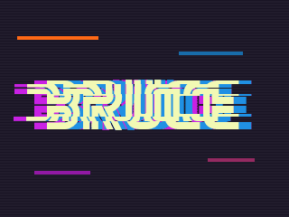
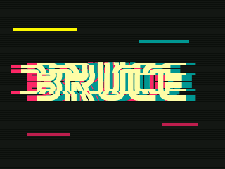
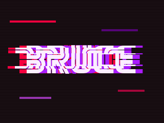
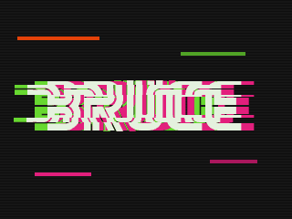
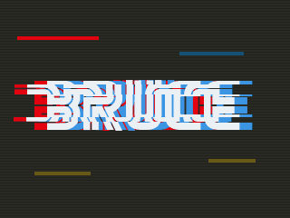

<div align="center">

# ▚▞ BRUCE GLITCH THEMES ▞▚

**Chromatic-aberration glitch themes for [Bruce](https://github.com/BruceDevices/firmware) ESP32 firmware,
generated straight from [Omarchy](https://omarchy.org) desktop color palettes.**

&nbsp;&nbsp;
<br>&nbsp;&nbsp;
<br>

`320×240` · `CYD ESP32-2432S028R` · `Bruce 1.16.1` · `fits in 192 KB of LittleFS`

</div>

---

## ▌Themes

### `japglitch`
Pale lime on midnight purple, split into magenta/cyan.


| priColor | secColor | bgColor | fringe | LED |
|---|---|---|---|---|
| `f7d6`  | `a52c`  | `20e5`  |  `#C921E4`  `#2090E3` | `C921E4` |

### `neon-unix-legs`
Neon butter-yellow on near-black green, split into hot pink/teal.


| priColor | secColor | bgColor | fringe | LED |
|---|---|---|---|---|
| `fff4`  | `ad4a`  | `10a2`  |  `#FC2866`  `#009792` | `FC2866` |

### `hypr-heels`
Lavender white on deep plum, split into crimson/violet.


| priColor | secColor | bgColor | fringe | LED |
|---|---|---|---|---|
| `ff7f`  | `acd5`  | `1882`  |  `#F5003E`  `#A91DFE` | `F5003E` |

### `omarfu`
Mint white on charcoal, split into lime/hot pink.


| priColor | secColor | bgColor | fringe | LED |
|---|---|---|---|---|
| `e79b`  | `94f1`  | `10a2`  |  `#67D830`  `#E21F7C` | `67D830` |

### `redflag-sword`
Ice white on warm slate, split into signal red/steel blue.


| priColor | secColor | bgColor | fringe | LED |
|---|---|---|---|---|
| `ef9e`  | `9cf4`  | `2944`  |  `#E3020F`  `#3B95E3` | `E3020F` |

<details>
<summary><b>Exact build commands for these themes</b></summary>

```bash
./bruce-theme-gen.py japglitch      --fringe C921E4,2090E3 --littlefs
./bruce-theme-gen.py neon-unix-legs --littlefs
./bruce-theme-gen.py hypr-heels     --fringe F5003E,A91DFE --littlefs
./bruce-theme-gen.py omarfu         --littlefs
./bruce-theme-gen.py redflag-sword  --littlefs
```
</details>

---

## ▌Install

Pick **one** of the three ways below.

### A — microSD card (easiest, lets you keep many themes)

1. Format a microSD card as **FAT32**. Any size works; the themes are ~85 KB each.
2. Copy a theme folder to the **root** of the card, e.g. `themes/japglitch/` → `SD:/japglitch/`.
3. On the device: **Config → UI Theme → SD → `japglitch/japglitch.json`**.

> [!NOTE]
> The first time Bruce boots with a card that has no `bruce.conf` on it, it writes a **default** config to the card, which resets your theme. Just pick the theme again once; from then on the setting is saved to both the card and internal storage.

### B — Flash a ready-made LittleFS image (no SD card needed)

Each [release](../../releases) has a `<theme>-littlefs.bin` containing the theme plus a tiny `bruce.conf` that selects it, so **the theme is active on the very next boot** without touching the screen.

```bash
# CYD 2432S028: Bruce's LittleFS ("spiffs") partition lives at 0x3d0000, size 0x30000
esptool --port /dev/ttyUSB0 --baud 460800 write-flash 0x3d0000 japglitch-littlefs.bin
```

> [!WARNING]
> This **replaces everything in Bruce's internal storage**: settings, saved Wi-Fi, IR/RF captures.
> Other boards use a different offset and size. Read the `spiffs` entry from the Bruce `.bin` for your board, then rebuild with `--fs-size`:
> ```bash
> python -c "import struct,sys;d=open(sys.argv[1],'rb').read()[0x8000:0x8c00]
> for i in range(0,len(d),32):
>  e=d[i:i+32]
>  if e[:2]!=b'\xaa\x50':break
>  o,s=struct.unpack('<II',e[4:12]);print(e[12:28].rstrip(b'\0').decode(),hex(o),hex(s))" Bruce-YOURBOARD.bin
> ```

### C — Build your own (see below) and use A or B.

---

## ▌Generate a theme from any Omarchy palette

```bash
pip install -r requirements.txt
./bruce-theme-gen.py neon-unix-legs                      # -> themes/neon-unix-legs/
./bruce-theme-gen.py japglitch --fringe C921E4,2090E3    # pin the RGB-split colors
./bruce-theme-gen.py hypr-heels --littlefs               # + flashable hypr-heels-littlefs.bin
./bruce-theme-gen.py tux-mosaic --sd --boot-wallpaper        # PNG icons + wallpaper boot anim (SD only)
./bruce-theme-gen.py --colors ~/my/colors.toml --name mine
```

It reads `~/.config/omarchy/themes/<name>/colors.toml` (or any file with `background`, `foreground`, `accent` and `color0`–`color15` as `"#RRGGBB"`), then:

| Step | What happens |
|---|---|
| 🎨 **Palette** | `foreground` → text/icons, `background` → bg, `color8` → unselected items. All converted to Bruce's **RGB565**. |
| 🌈 **Fringe** | Picks the two most vivid, most hue-separated palette colors that *aren't* close to the icon color. Override with `--fringe`. |
| 🔣 **Icons** | Material Design glyphs from **JetBrainsMono Nerd Font**, centred, RGB-split, with sliced scanline displacement and accent glitch bars. Same seed per icon, so rebuilds come out identical. |
| 🎞️ **Boot** | 8-frame GIF: the `BRUCE` title glitches in and settles (MrRobot font if installed). |
| 🧾 **JSON** | Writes `<name>.json` with every menu key, border on, and the LED set to the first fringe color. |
| 💾 **LittleFS** | Optional `--littlefs`: builds a flash image (4 KB blocks, `name_max=64`) with a preset `bruce.conf`. |

<details>
<summary><b>All options</b></summary>

| Flag | Default | |
|---|---|---|
| `--screen WxH` | `320x240` | Device resolution |
| `--icon-size PX` | 55% of height | Icon size (75% with `--no-label`) |
| `--no-label` | off | Hide menu names under icons, use bigger icons |
| `--sd` | off | PNG icons instead of JPG (sharper, see size notes) |
| `--boot-wallpaper [FILE]` | off | Put the theme's wallpaper behind the boot title |
| `--fringe HEX,HEX` | auto | RGB-split colors |
| `--littlefs [OUT]` | off | Also build a LittleFS image |
| `--fs-size N` | `0x30000` | LittleFS partition size |
| `--out DIR` | `themes` | Output root |

Other boards, per the Bruce wiki: Cardputer / StickC Plus `--screen 240x135`, T-Embed `--screen 320x170`, T-LoRa Pager `--screen 480x222`.
</details>

---

## ▌Things I learned the hard way

- **PNG icons blow up LittleFS.** Bruce 1.16 decodes each PNG once and caches it as raw RGB565 in `<theme>/tmp/<icon>.bin`. At 130 px that's ~34 KB *per icon*, about 500 KB for a full set, and the CYD only has **192 KB** of LittleFS. It fills up, Bruce shows `LittleFS is Full` (it needs ≥ 4 KB free) and floods serial with `lfs.c: No more free space`. **JPG and BMP are drawn directly, with no cache**, so the default output is JPG. Use `--sd` (PNG) only for themes that live on a microSD card.
- **Colors are RGB565 hex, not `#RRGGBB`.** White is `ffff`, not `ffffff`. LED colors *are* normal hex.
- **`themeOnSd` means the filesystem, not a yes/no:** `1` = LittleFS, `2` = SD.
- **Scanline textures ruin JPG compression.** Icons without them are ~3–5 KB each.
- **The wallpaper boot GIF is ~130 KB,** fine on SD but too big for internal storage alongside the icons. The plain-background version is ~21 KB.

---

## ▌theme.json reference

```jsonc
{
  "wifi": "wifi.jpg", "ble": "ble.jpg", "rf": "rf.jpg", "rfid": "rfid.jpg",
  "fm": "fm.jpg", "ir": "ir.jpg", "files": "files.jpg", "gps": "gps.jpg",
  "nrf": "nrf.jpg", "interpreter": "interpreter.jpg", "clock": "clock.jpg",
  "lora": "lora.jpg", "others": "others.jpg", "connect": "connect.jpg", "config": "config.jpg",
  "priColor": "f7d6",   // RGB565: text + selected
  "secColor": "a52c",   // RGB565: unselected items
  "bgColor":  "20e5",   // RGB565: background
  "border": 1,          // frame around the menu
  "label": 1,           // show menu name under icon (use ~50 px smaller icons)
  "boot_img": "boot.gif",
  "ledBright": 60, "ledColor": "C921E4", "ledEffect": 0, "ledEffectSpeed": 3, "ledEffectDirection": 1
}
```

Paths are relative to the JSON file. Supported images: BMP, JPG, PNG, GIF.

---

<div align="center">

Themes and generator: MIT. Bruce is © its authors ([BruceDevices/firmware](https://github.com/BruceDevices/firmware)).
Palettes come from Omarchy themes. Icons are rendered from [Nerd Fonts](https://www.nerdfonts.com) Material Design glyphs.

<sub>▚▞▚▞ made on Omarchy, tested on a real Cheap Yellow Display ▞▚▞▚</sub>

</div>
