<div align="center">

# ▚▞ BRUCE THEMES ▞▚

**Custom themes for [Bruce](https://github.com/BruceDevices/firmware) ESP32 firmware in three collections:
glitch themes generated from [Omarchy](https://omarchy.org) desktop palettes, dripping monster themes, and pop-culture tributes.**

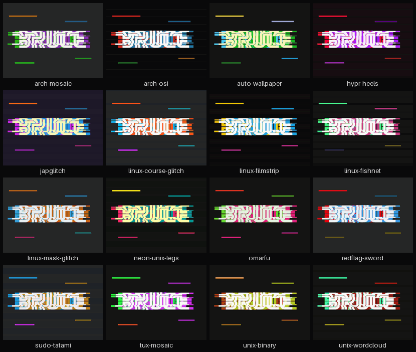

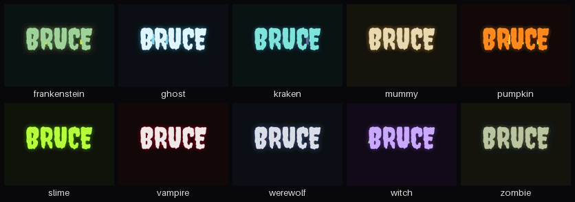

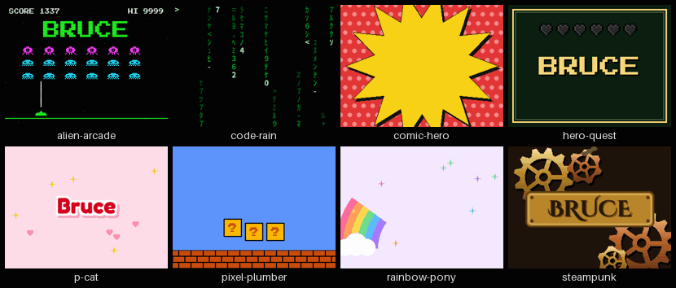

`320×240` · `CYD ESP32-2432S028R` · `Bruce 1.16.1` · `58 themes` · `each fits in 192 KB of LittleFS`

**[▚ Glitch collection](#glitch-collection-16)** · **[🦇 Monster collection](#monster-collection-10)** · **[🎮 Pop collection](#pop-collection-32)** · **[Install](#install)** · **[Make your own](#generate-a-theme-from-any-omarchy-palette)**

</div>

---

## ▌Glitch collection (16)

Chromatic-aberration icons (RGB-split, sliced scanlines, glitch bars), each built from the Omarchy theme of the same name. Folder: [`themes/`](themes/). Colors are Bruce RGB565 values.

<!-- glitch:start -->
| Theme | Icons | Text / dim / bg | LED |
|---|---|---|---|
| **`arch-mosaic`**<br><sub>[boot](previews/arch-mosaic-boot.gif)</sub> | 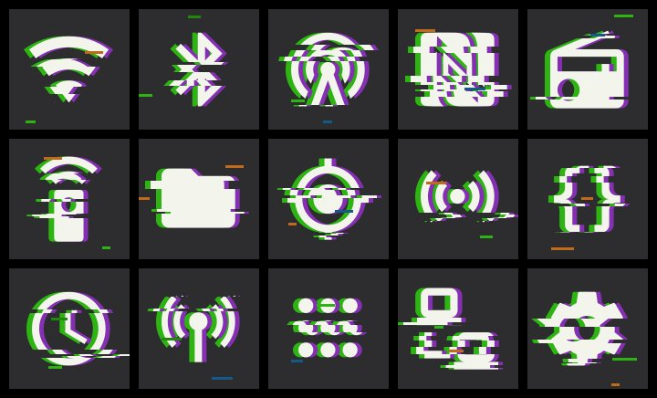 |   <br><sub>`f7bd` `a513` `2965`</sub> |  |
| **`arch-osi`**<br><sub>[boot](previews/arch-osi-boot.gif)</sub> | 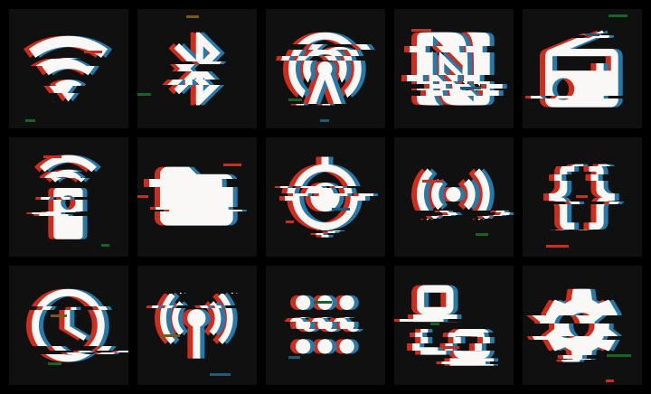 |   <br><sub>`ffde` `a534` `1082`</sub> |  |
| **`auto-wallpaper`**<br><sub>[boot](previews/auto-wallpaper-boot.gif)</sub> | 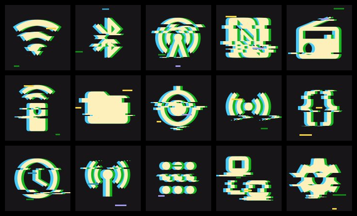 |   <br><sub>`ff97` `aced` `10a2`</sub> |  |
| **`hypr-heels`**<br><sub>[boot](previews/hypr-heels-boot.gif)</sub> | 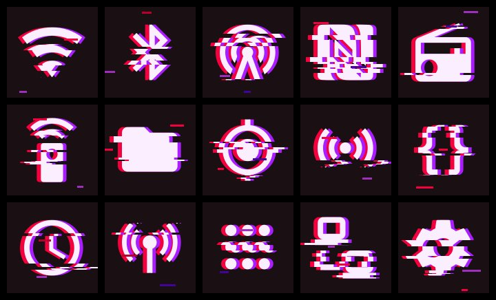 |   <br><sub>`ff7f` `acd5` `1882`</sub> |  |
| **`japglitch`**<br><sub>[boot](previews/japglitch-boot.gif)</sub> | 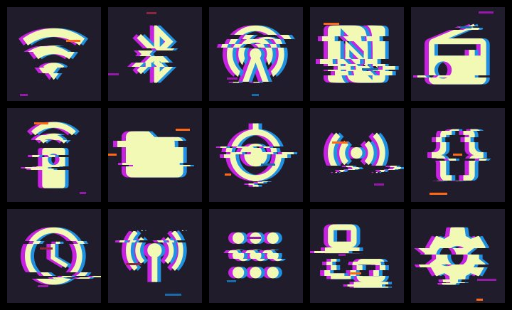 |   <br><sub>`f7d6` `a52c` `20e5`</sub> |  |
| **`linux-course-glitch`**<br><sub>[boot](previews/linux-course-glitch-boot.gif)</sub> | 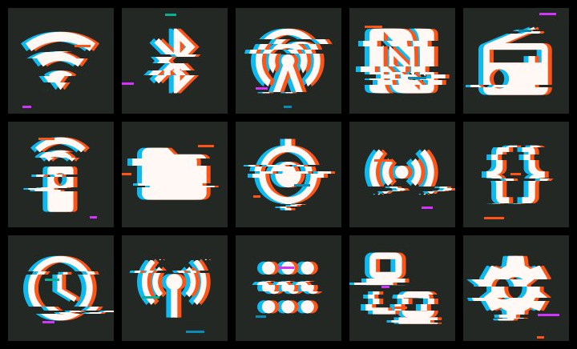 |   <br><sub>`ffde` `ad34` `2144`</sub> |  |
| **`linux-filmstrip`**<br><sub>[boot](previews/linux-filmstrip-boot.gif)</sub> | 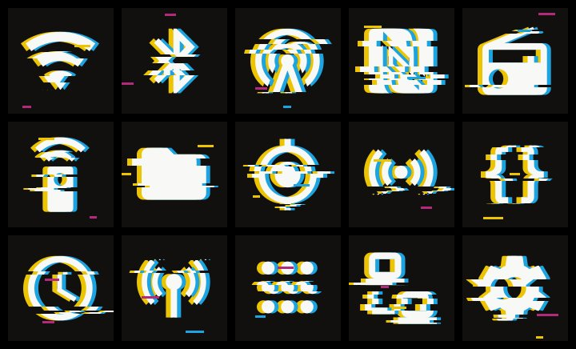 |   <br><sub>`ffde` `a534` `1081`</sub> |  |
| **`linux-fishnet`**<br><sub>[boot](previews/linux-fishnet-boot.gif)</sub> | 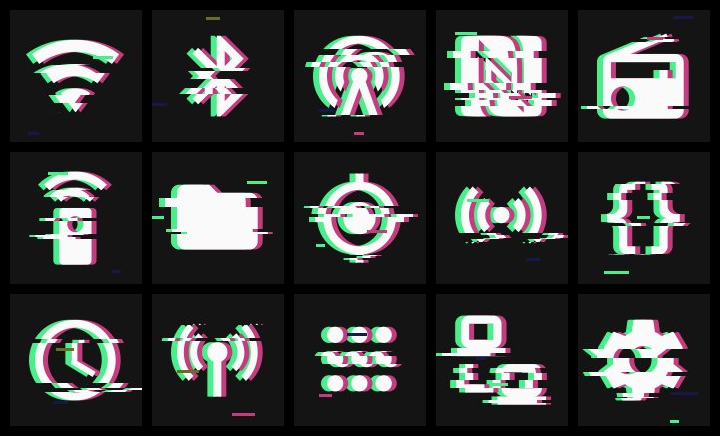 |   <br><sub>`ffdf` `a534` `10a2`</sub> |  |
| **`linux-mask-glitch`**<br><sub>[boot](previews/linux-mask-glitch-boot.gif)</sub> | 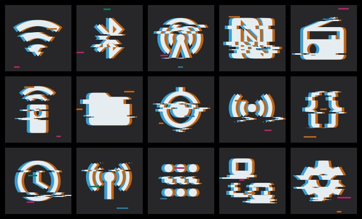 |   <br><sub>`e77e` `94d3` `2125`</sub> |  |
| **`neon-unix-legs`**<br><sub>[boot](previews/neon-unix-legs-boot.gif)</sub> | 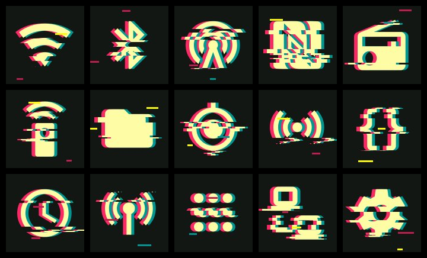 |   <br><sub>`fff4` `ad4a` `10a2`</sub> |  |
| **`omarfu`**<br><sub>[boot](previews/omarfu-boot.gif)</sub> | 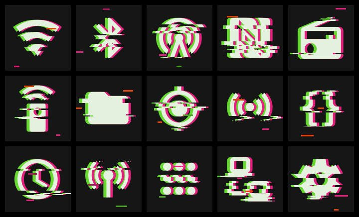 |   <br><sub>`e79b` `94f1` `10a2`</sub> |  |
| **`redflag-sword`**<br><sub>[boot](previews/redflag-sword-boot.gif)</sub> | 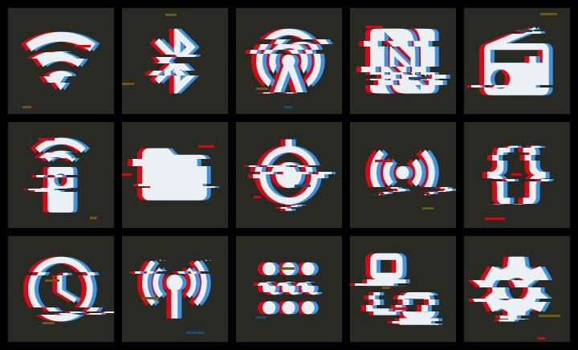 |   <br><sub>`ef9e` `9cf4` `2944`</sub> |  |
| **`sudo-tatami`**<br><sub>[boot](previews/sudo-tatami-boot.gif)</sub> | 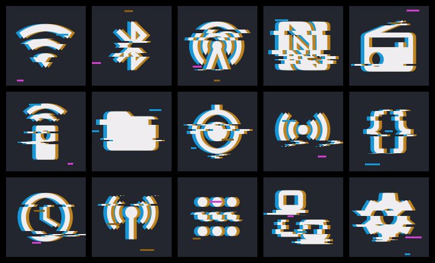 |   <br><sub>`ef7d` `9cd3` `2125`</sub> |  |
| **`tux-mosaic`**<br><sub>[boot](previews/tux-mosaic-boot.gif)</sub> | 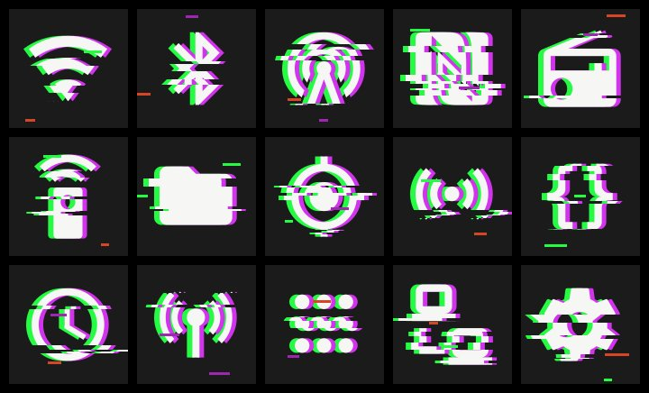 |   <br><sub>`f7be` `a514` `18c3`</sub> |  |
| **`unix-binary`**<br><sub>[boot](previews/unix-binary-boot.gif)</sub> | 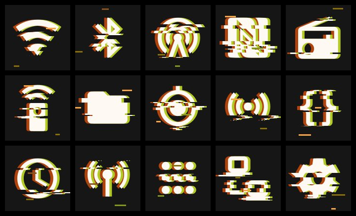 |   <br><sub>`ffde` `ad34` `10a2`</sub> |  |
| **`unix-wordcloud`**<br><sub>[boot](previews/unix-wordcloud-boot.gif)</sub> | 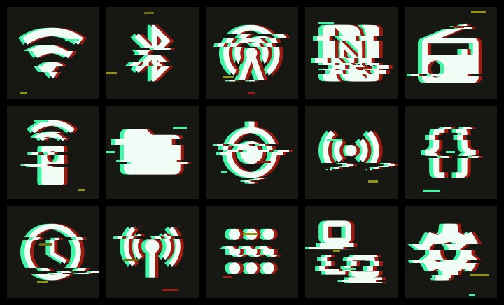 |   <br><sub>`f7fe` `9d54` `10a2`</sub> |  |

> `auto-wallpaper` is Omarchy's wallust theme that re-colors itself from the current wallpaper, so its Bruce version is a snapshot.

<details>
<summary><b>Exact build commands</b></summary>

```bash
./bruce-theme-gen.py arch-mosaic          --littlefs
./bruce-theme-gen.py arch-osi             --littlefs
./bruce-theme-gen.py auto-wallpaper       --littlefs
./bruce-theme-gen.py hypr-heels           --fringe F5003E,A91DFE --littlefs
./bruce-theme-gen.py japglitch            --fringe C921E4,2090E3 --littlefs
./bruce-theme-gen.py linux-course-glitch  --littlefs
./bruce-theme-gen.py linux-filmstrip      --littlefs
./bruce-theme-gen.py linux-fishnet        --littlefs
./bruce-theme-gen.py linux-mask-glitch    --littlefs
./bruce-theme-gen.py neon-unix-legs       --littlefs
./bruce-theme-gen.py omarfu               --littlefs
./bruce-theme-gen.py redflag-sword        --littlefs
./bruce-theme-gen.py sudo-tatami          --littlefs
./bruce-theme-gen.py tux-mosaic           --littlefs
./bruce-theme-gen.py unix-binary          --littlefs
./bruce-theme-gen.py unix-wordcloud       --littlefs
```
</details>
<!-- glitch:end -->

---

## ▌Monster collection (10)

Every menu becomes a monster, drawn with a glow and dripping slime, blood or ectoplasm. The boot screen is a dripping **BRUCE** in the [Creepster](https://fonts.google.com/specimen/Creepster) horror font. Folder: [`monster/`](monster/).

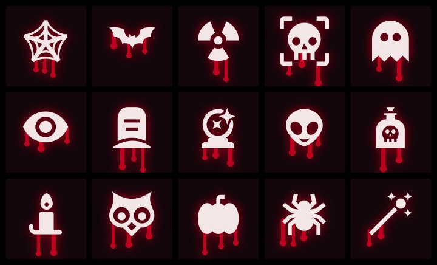

| Menu | Monster | Why |
|---|---|---|
| WiFi | 🕸️ spider web | the web you tap into |
| BLE | 🦇 bat | a short-range flyer |
| RF | ☢️ radioactive | it's radiation |
| RFID | 💀 skull scan | scanning for victims |
| FM | 👻 ghost | voices on the radio |
| IR | 👁️ eye | sees what you can't |
| Files | 🪦 gravestone | where things are buried |
| GPS | 🔮 crystal ball | finds you anywhere |
| NRF24 | 👽 alien | signals from elsewhere |
| Interpreter | 🧪 skull potion | scripts are potions |
| Clock | 🕯️ candle | time burning down |
| LoRa | 🦉 owl | sees far in the dark |
| Others | 🎃 pumpkin | the grab bag |
| Connect | 🕷️ spider | spins the connections |
| Config | 🪄 magic staff | bend the device to your will |

<!-- monster:start -->
| Theme | Icons | Text / dim / bg | LED |
|---|---|---|---|
| **`frankenstein`**<br><sub>[boot](previews/monster/frankenstein-boot.gif)</sub> | 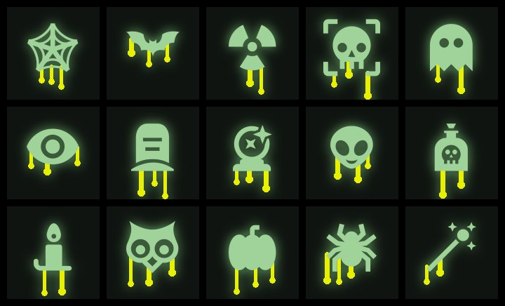 |   <br><sub>`9e93` `5bcb` `8a2`</sub> |  |
| **`ghost`**<br><sub>[boot](previews/monster/ghost-boot.gif)</sub> | 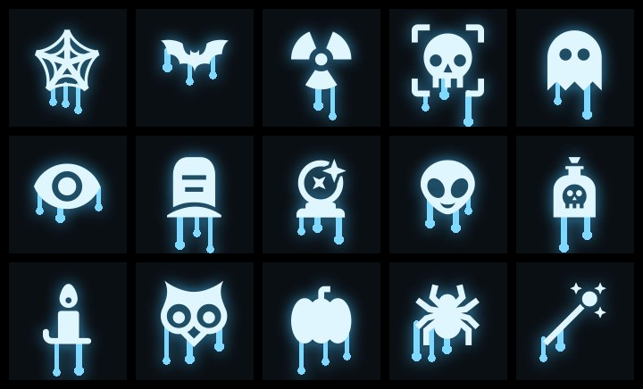 |   <br><sub>`dfbf` `7c94` `862`</sub> |  |
| **`kraken`**<br><sub>[boot](previews/monster/kraken-boot.gif)</sub> | 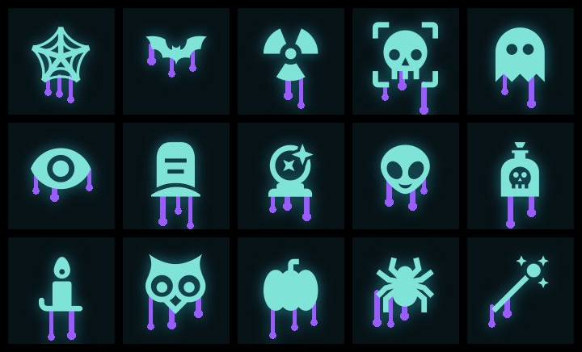 |   <br><sub>`7f1b` `4c30` `82`</sub> |  |
| **`mummy`**<br><sub>[boot](previews/monster/mummy-boot.gif)</sub> | 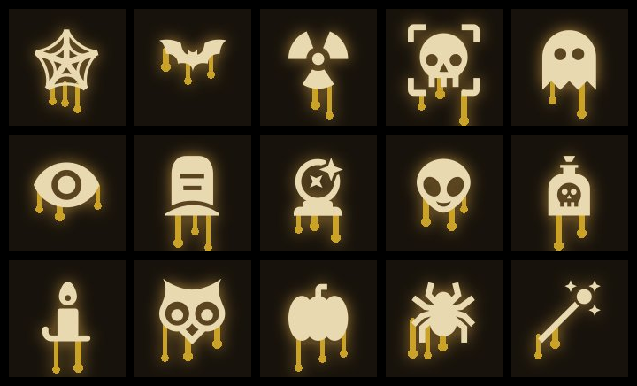 |   <br><sub>`eed6` `8c2d` `1081`</sub> |  |
| **`pumpkin`**<br><sub>[boot](previews/monster/pumpkin-boot.gif)</sub> | 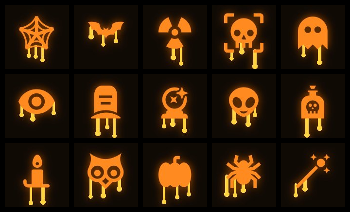 |   <br><sub>`fc43` `9305` `1040`</sub> |  |
| **`slime`**<br><sub>[boot](previews/monster/slime-boot.gif)</sub> | 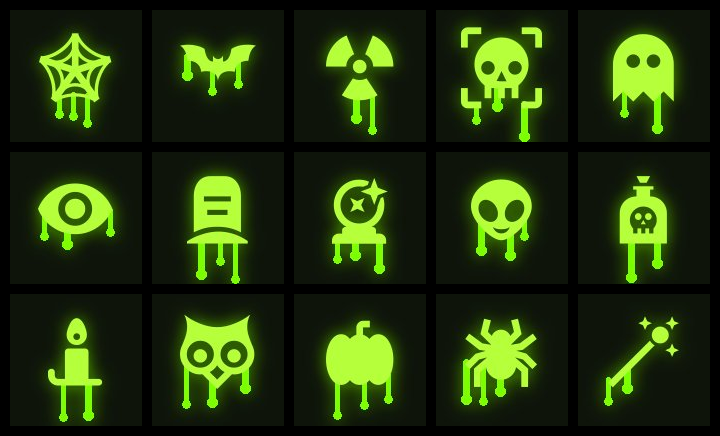 |   <br><sub>`b7e7` `6c67` `8a1`</sub> |  |
| **`vampire`**<br><sub>[boot](previews/monster/vampire-boot.gif)</sub> |  |   <br><sub>`f73c` `8b6e` `1021`</sub> |  |
| **`werewolf`**<br><sub>[boot](previews/monster/werewolf-boot.gif)</sub> | 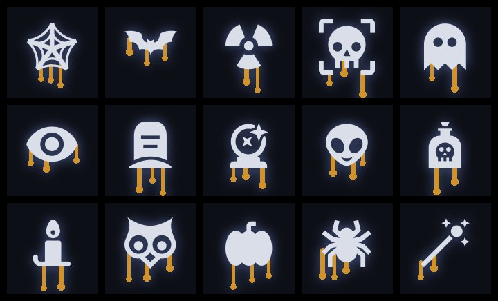 |   <br><sub>`defd` `7c12` `862`</sub> |  |
| **`witch`**<br><sub>[boot](previews/monster/witch-boot.gif)</sub> | 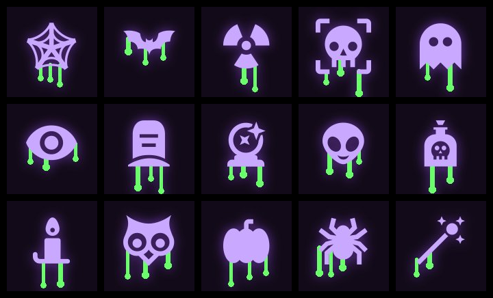 |   <br><sub>`cd5f` `7b33` `1043`</sub> |  |
| **`zombie`**<br><sub>[boot](previews/monster/zombie-boot.gif)</sub> | 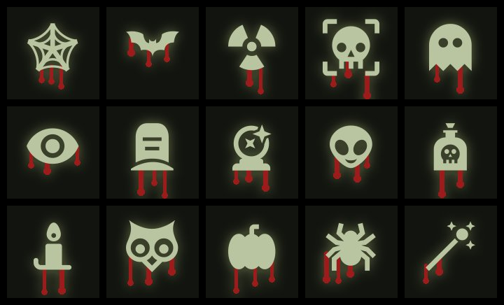 |   <br><sub>`be34` `6bac` `10a1`</sub> |  |
<!-- monster:end -->

<details>
<summary><b>Build the monsters</b></summary>

```bash
./bruce-monster-gen.py                     # all 10 -> monster/<name>/
./bruce-monster-gen.py vampire --littlefs  # one monster + local/vampire-littlefs.bin
```

To add a monster, add a line to `MONSTERS` in `bruce-monster-gen.py` with `(background, text, dim text, drip, glow)` colors, then run `./tools-gallery.py`.
</details>

---

## ▌Pop collection (32)

Tributes to games, movies, cartoons and genres, each with its own art style instead of a shared effect. The build shrinks JPG quality automatically until every theme fits the CYD's 192 KB internal storage. Folder: [`pop/`](pop/).

| Theme | Inspired by | Style | Boot screen |
|---|---|---|---|
| **`p-cat`** | a certain bow-wearing cat | White-outlined candy-pink stickers with gold sparkles: cloud, butterfly, gift, candy, cupcake, teacup, teddy, cat, bow | Bubbly red **Bruce** in [Fredoka](https://fonts.google.com/specimen/Fredoka) with a bow and floating hearts |
| **`hero-quest`** | 8-bit adventure games | NES-style pixel sprites on a dark forest: bow, key, shield, compass, boomerang, potion, horse, bomb, heart, sword | Heart meter fills up, then *"IT'S DANGEROUS TO GO ALONE! TAKE THIS."* in [Press Start 2P](https://fonts.google.com/specimen/Press+Start+2P) |
| **`pixel-plumber`** | 8-bit platformers | Bright pixel sprites on sky blue: star, hand-drawn warp pipe, ? block, mushroom, castle, ghost, flag, hammer | **BRUCE** drops in over a brick floor while ? blocks bump, then *PRESS START* |
| **`code-rain`** | green digital rain | Katakana code rain behind glowing icons: rotary phone, white rabbit, sunglasses, red pill, and a spoon (there is no spoon) | The rain clears to reveal **BRUCE**, then *wake up, neo...* |
| **`steampunk`** | Victorian science fiction | Engraved brass, copper and pewter icons with rivets on dark leather: airship balloon, gauge, safe, compass rose, magnet, pocket watch, telescope, bowler hat, locomotive, cogs | Meshed gears turn behind a riveted brass **BRUCE** plaque in [Cinzel Decorative](https://fonts.google.com/specimen/Cinzel+Decorative), then *~ patent pending ~* with steam puffs |
| **`comic-hero`** | superhero comic books | Halftone comic panels with thick ink outlines: radar, shield star, lightning, drama masks, atom, robot, spider, flexed arm, hammer | **BRUCE!** in [Bangers](https://fonts.google.com/specimen/Bangers) shakes onto a starburst, then *POW!* and *ZAP!* bubbles pop in |
| **`alien-arcade`** | 80s arcade shooters | Neon pixel sprites on a starfield: radar, UFO, TV, safe, bullseye, alien, joystick pad, rocket, shooting star, earth | Original pixel aliens march in formation over a laser cannon, with a *SCORE / HI* bar and blinking *INSERT COIN* |
| **`rainbow-pony`** | magical cartoon ponies | Glossy pastel badges with a shine and sparkles: cloud, butterfly, magic wand, gem, treble clef, firework, balloon, cupcake, kite, unicorn, hearts, crown | A rainbow sweeps across between two clouds, then a unicorn and **Bruce** in [Pacifico](https://fonts.google.com/specimen/Pacifico) appear with *sparkle on!* |
| **`wild-encounter`** | handheld monster-catching games | Four-shade green handheld pixel art in menu boxes: bird, lightning, fire, water, backpack, map, egg, tent, paw, trade arrows, potion | A battle screen: flash, stripe wipe, then an original microchip creature slides in with HP bars, and *A wild BRUCE appeared!* types out |
| **`maze-chomper`** | 80s maze arcade games | Neon pixel sprites inside double blue maze walls with a row of dots | A chomper eats its way across the dots while two ghosts chase it, then *READY!* |
| **`block-stack`** | falling-block puzzle games | Every icon built from bevelled blocks on a dark well grid | The letters of BRUCE fall in one by one and land, then a full line flashes and clears |
| **`block-craft`** | blocky sandbox games | Pixel "item" sprites on dirt, stone and grass block textures | Grey blocks stack up on a grass floor under a 3D BRUCE, with a yellow *Now with WiFi!* splash |
| **`wasteland-terminal`** | retro-future wasteland computers | Green CRT phosphor with scanlines and corner brackets | A green terminal types out *BRUCE INDUSTRIES UNIFIED OS … WELCOME, OVERSEER.*, then a thumbs-up |
| **`versus-fighter`** | 90s fighting games | Fire-gradient icons with ink outlines on diagonal red stripes | A red/blue split screen, BRUCE vs CYD, then *VS*, *ROUND 1*, *FIGHT!* in flames |
| **`soul-battle`** | indie RPG battles | White 1-bit sprites in white battle boxes with a little red heart | *\* BRUCE blocks the way!*, a dodging heart, and *FIGHT / ACT / ITEM / SPARE* buttons |
| **`vector-rocks`** | vector-screen space shooters | Thin white vector outlines on black | Wireframe rocks drift past a spinning ship, with an outlined BRUCE and a score |
| **`speed-rings`** | fast blue platformers | White icons inside spinning gold rings on a blue speed-line sky | BRUCE zooms in, leaning forward, over speed lines and spinning rings |
| **`hacker-mask`** | hacker TV dramas | White icons on red spray-brush strokes, with a `>_` prompt | A masked figure glitches in over a red brush stroke: BRUCE, *hello, friend.* |
| **`starship-panel`** | starship computer panels | Rounded "elbow" panel bars in orange, lilac and blue, with panel numbers | Status blocks light up one by one next to BRUCE: *ALL SYSTEMS NOMINAL* |
| **`space-crawl`** | space-opera movies | Yellow icons tilted back into space over a starfield | *Not long ago, on a workbench nearby....* then the slanted yellow text crawl: *EPISODE CYD, BRUCE* |
| **`wall-lights`** | 80s small-town sci-fi | Red neon outlines under a string of coloured Christmas lights | Bulbs over a painted wall alphabet blink out B-R-U-C-E, then a red neon title |
| **`time-circuits`** | time-travel movies | Glowing red, green and amber icons in labelled dashboard displays | Three seven-segment time displays switch on: *DESTINATION TIME*, *PRESENT TIME*, *LAST TIME DEPARTED* |
| **`magic-word`** | 90s dinosaur-park movies | Black 1-bit pixel icons in old-computer windows | A security interface prints *access: PERMISSION DENIED....and....* then *YOU DIDN'T SAY THE MAGIC WORD!* |
| **`ghost-zapper`** | 80s ghost-hunting comedies | White icons in dripping green slime on dark purple | Energy streams zap a ghost down into a trap, then a slime-green BRUCE |
| **`light-grid`** | neon cyber movies | Glowing cyan and orange outlines over a perspective grid | Two light-cycle trails race across the grid under a glowing BRUCE |
| **`gacha-pull`** | gacha games | Rarity cards with gold, purple and blue frames and 3–5 stars | A summoning circle, a beam of light, rainbow glints, then a card flips to a 5-star BRUCE: *SSR GET!* |
| **`dimension-hop`** | portal-hopping sci-fi cartoons | White icons in front of swirling green portals | A green portal spirals open, then a wobbly BRUCE and *\*burp\* ...let's go.* |
| **`tiny-invader`** | alien-invader cartoons | Hot-pink alien-tech glow on a black hexagon grid | Pink circuit traces power up, then BRUCE and *ALL HAIL BRUCE* |
| **`couch-critics`** | 90s couch-potato cartoons | Scribbly black marker outlines on flat yellow, blue, orange and green | An old wooden TV shows static, then a scribbled BRUCE and *heh heh. this rocks.* |
| **`rad-adventure`** | candy-coloured adventure cartoons | Chunky round badges with thick navy outlines over green hills: sword, crown, candy, dog, backpack, tree, hat | BRUCE bounces in over rolling hills with a sun, clouds and a big treehouse tree, then *Mathematical!* |
| **`sugar-kingdom`** | candy-kingdom cartoon worlds | Glossy candy balls inside candy-cane rims on pink frosting with sprinkles: ice cream, cupcake, candy, castle, heart, crown | Peppermint-striped candy towers rise over gumdrops under a frosting-dripped BRUCE: *welcome to the sugar kingdom!* |
| **`candy-match`** | match-3 candy puzzle games | Shiny jelly candies (round, square, drop and diamond) on a purple game board | A board of candies where a row matches and pops, then chunky candy letters: BRUCE, *Sugar rush!* |

<!-- pop:start -->
| Theme | Icons | Text / dim / bg | LED |
|---|---|---|---|
| **`alien-arcade`**<br><sub>[boot](previews/pop/alien-arcade-boot.gif)</sub> | 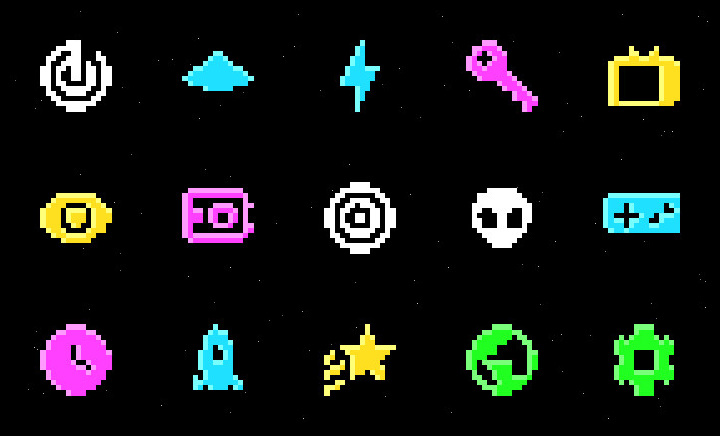 |   <br><sub>`ffff` `27e4` `0`</sub> |  |
| **`block-craft`**<br><sub>[boot](previews/pop/block-craft-boot.gif)</sub> | 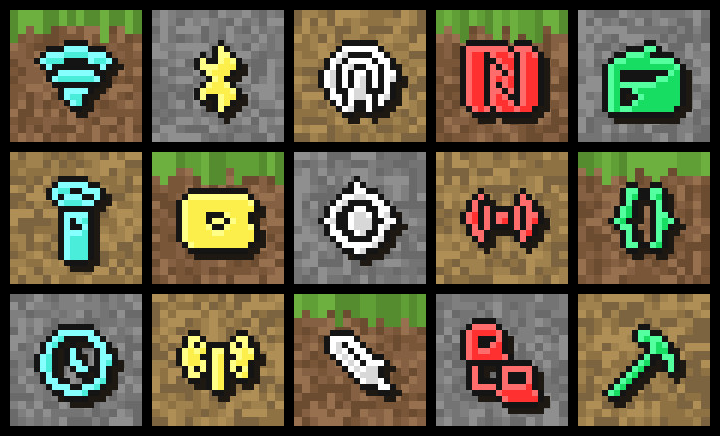 |   <br><sub>`ffff` `a514` `2945`</sub> |  |
| **`block-stack`**<br><sub>[boot](previews/pop/block-stack-boot.gif)</sub> | 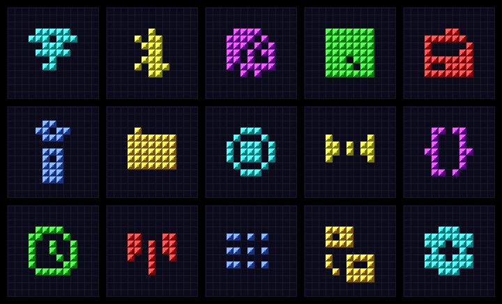 |   <br><sub>`ffff` `79e` `843`</sub> |  |
| **`candy-match`**<br><sub>[boot](previews/pop/candy-match-boot.gif)</sub> | 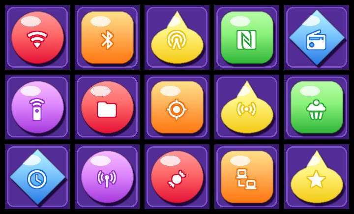 |   <br><sub>`ff09` `cd5f` `38cd`</sub> |  |
| **`code-rain`**<br><sub>[boot](previews/pop/code-rain-boot.gif)</sub> | 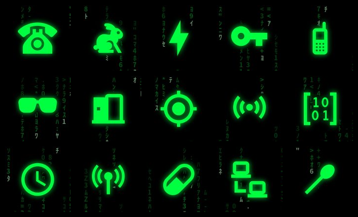 |   <br><sub>`7e8` `462` `0`</sub> |  |
| **`comic-hero`**<br><sub>[boot](previews/pop/comic-hero-boot.gif)</sub> | 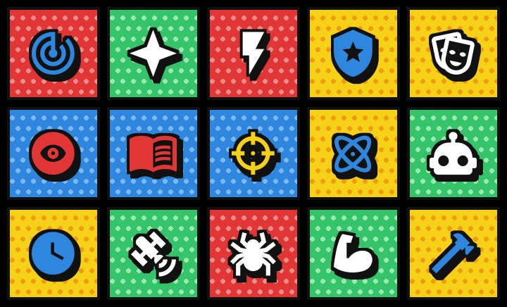 |   <br><sub>`1082` `8b49` `ffba`</sub> |  |
| **`couch-critics`**<br><sub>[boot](previews/pop/couch-critics-boot.gif)</sub> | 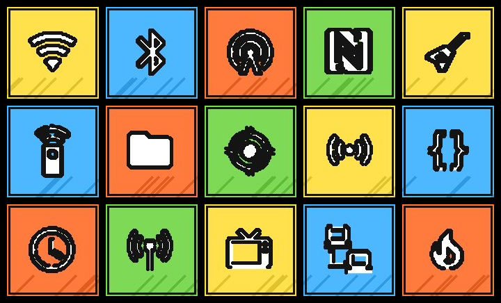 |   <br><sub>`ff09` `8d3f` `194d`</sub> |  |
| **`dimension-hop`**<br><sub>[boot](previews/pop/dimension-hop-boot.gif)</sub> | 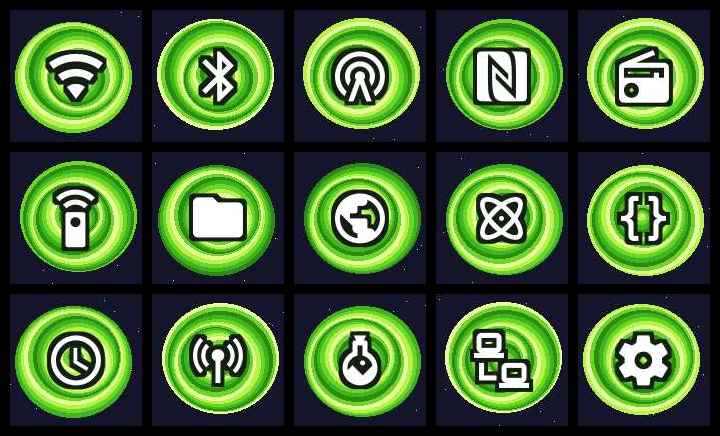 |   <br><sub>`b789` `6d17` `10a5`</sub> |  |
| **`gacha-pull`**<br><sub>[boot](previews/pop/gacha-pull-boot.gif)</sub> | 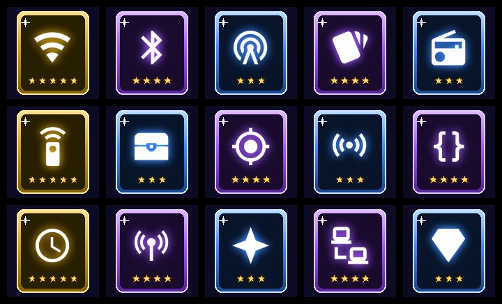 |   <br><sub>`fead` `8bda` `844`</sub> |  |
| **`ghost-zapper`**<br><sub>[boot](previews/pop/ghost-zapper-boot.gif)</sub> | 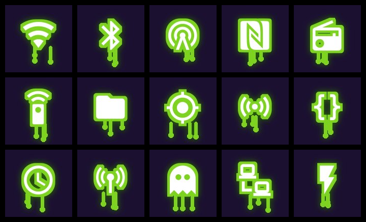 |   <br><sub>`b7e7` `7af6` `1886`</sub> |  |
| **`hacker-mask`**<br><sub>[boot](previews/pop/hacker-mask-boot.gif)</sub> | 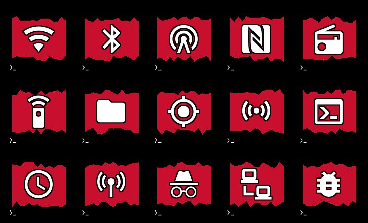 |   <br><sub>`ffff` `c885` `0`</sub> |  |
| **`hero-quest`**<br><sub>[boot](previews/pop/hero-quest-boot.gif)</sub> | 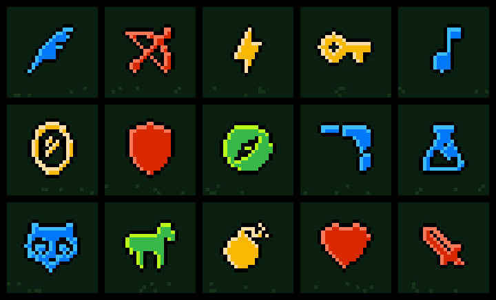 |   <br><sub>`fecf` `7d0e` `8e2`</sub> |  |
| **`light-grid`**<br><sub>[boot](previews/pop/light-grid-boot.gif)</sub> | 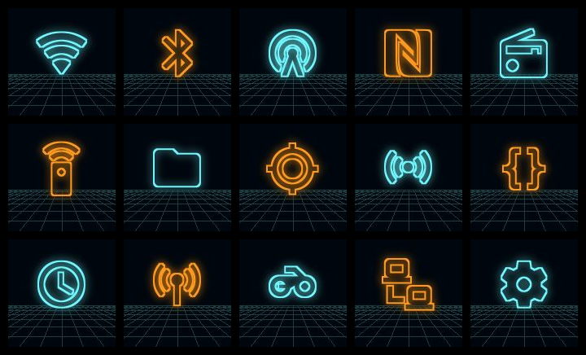 |   <br><sub>`6fbf` `1b71` `21`</sub> |  |
| **`magic-word`**<br><sub>[boot](previews/pop/magic-word-boot.gif)</sub> | 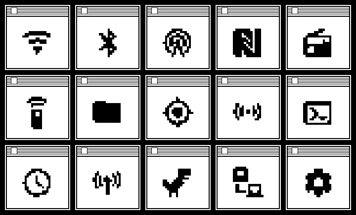 |   <br><sub>`0` `8410` `ffff`</sub> |  |
| **`maze-chomper`**<br><sub>[boot](previews/pop/maze-chomper-boot.gif)</sub> | 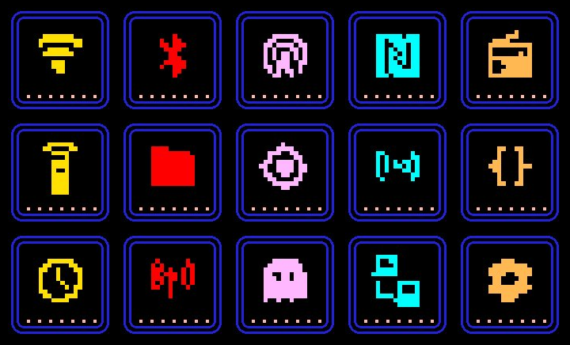 |   <br><sub>`ff00` `211b` `0`</sub> |  |
| **`p-cat`**<br><sub>[boot](previews/pop/p-cat-boot.gif)</sub> | 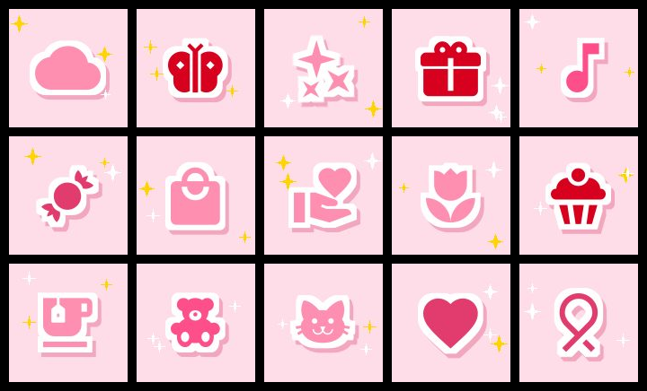 |   <br><sub>`d003` `b32f` `fefd`</sub> |  |
| **`pixel-plumber`**<br><sub>[boot](previews/pop/pixel-plumber-boot.gif)</sub> | 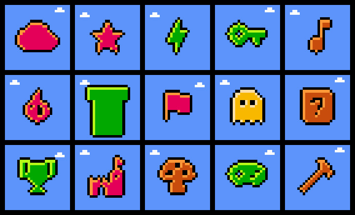 |   <br><sub>`ffff` `19f3` `5cbf`</sub> |  |
| **`rad-adventure`**<br><sub>[boot](previews/pop/rad-adventure-boot.gif)</sub> | 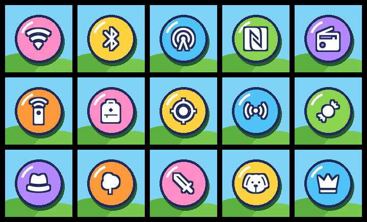 |   <br><sub>`194b` `2b75` `7e9e`</sub> |  |
| **`rainbow-pony`**<br><sub>[boot](previews/pop/rainbow-pony-boot.gif)</sub> | 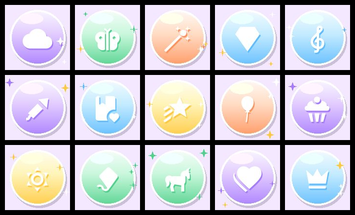 |   <br><sub>`9a79` `bc7a` `f75f`</sub> |  |
| **`soul-battle`**<br><sub>[boot](previews/pop/soul-battle-boot.gif)</sub> | 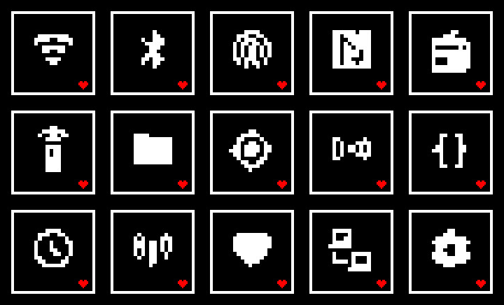 |   <br><sub>`ffff` `fc60` `0`</sub> |  |
| **`space-crawl`**<br><sub>[boot](previews/pop/space-crawl-boot.gif)</sub> | 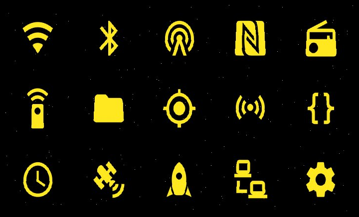 |   <br><sub>`ff43` `4d3f` `0`</sub> |  |
| **`speed-rings`**<br><sub>[boot](previews/pop/speed-rings-boot.gif)</sub> | 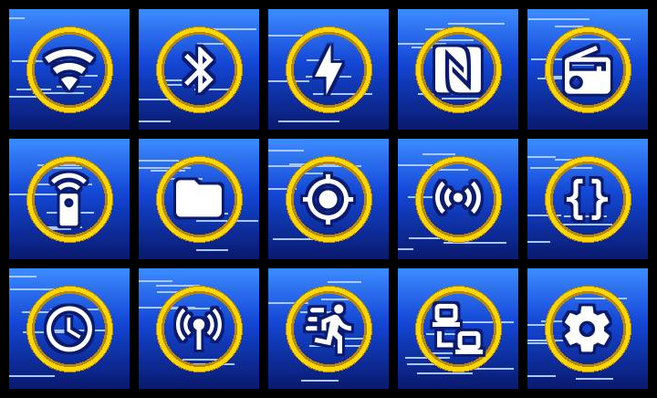 |   <br><sub>`ffff` `fea0` `953`</sub> |  |
| **`starship-panel`**<br><sub>[boot](previews/pop/starship-panel-boot.gif)</sub> | 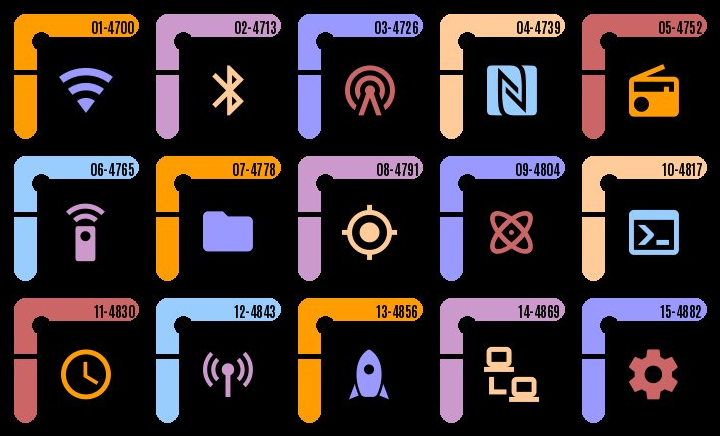 |   <br><sub>`fce0` `ccd9` `0`</sub> |  |
| **`steampunk`**<br><sub>[boot](previews/pop/steampunk-boot.gif)</sub> | 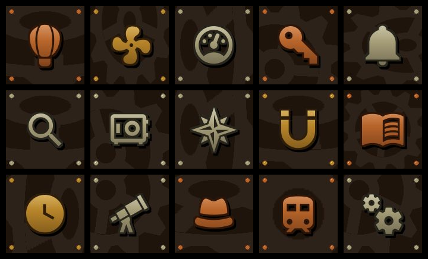 |   <br><sub>`ee0e` `8b47` `18a1`</sub> |  |
| **`sugar-kingdom`**<br><sub>[boot](previews/pop/sugar-kingdom-boot.gif)</sub> | 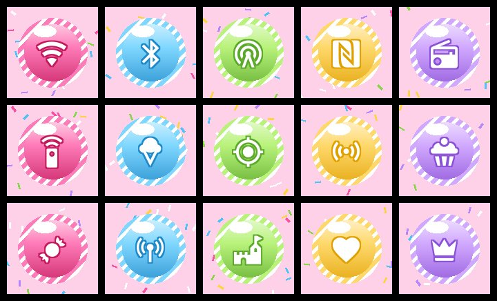 |   <br><sub>`c0cb` `e3d5` `fe9d`</sub> |  |
| **`time-circuits`**<br><sub>[boot](previews/pop/time-circuits-boot.gif)</sub> | 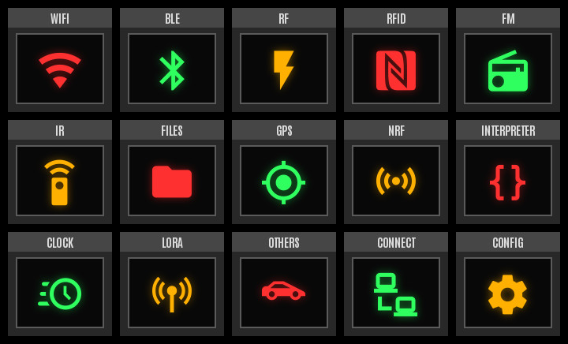 |   <br><sub>`f986` `37ec` `18e3`</sub> |  |
| **`tiny-invader`**<br><sub>[boot](previews/pop/tiny-invader-boot.gif)</sub> | 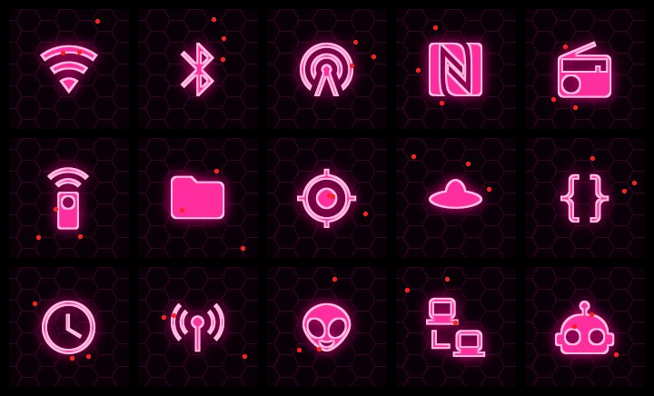 |   <br><sub>`f973` `894d` `801`</sub> |  |
| **`vector-rocks`**<br><sub>[boot](previews/pop/vector-rocks-boot.gif)</sub> | 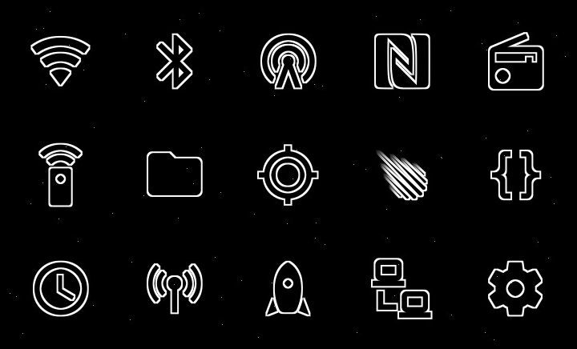 |   <br><sub>`ffff` `8410` `0`</sub> |  |
| **`versus-fighter`**<br><sub>[boot](previews/pop/versus-fighter-boot.gif)</sub> | 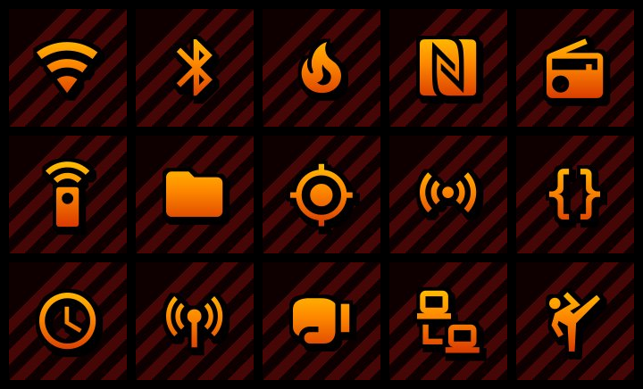 |   <br><sub>`fe80` `b184` `1000`</sub> |  |
| **`wall-lights`**<br><sub>[boot](previews/pop/wall-lights-boot.gif)</sub> | 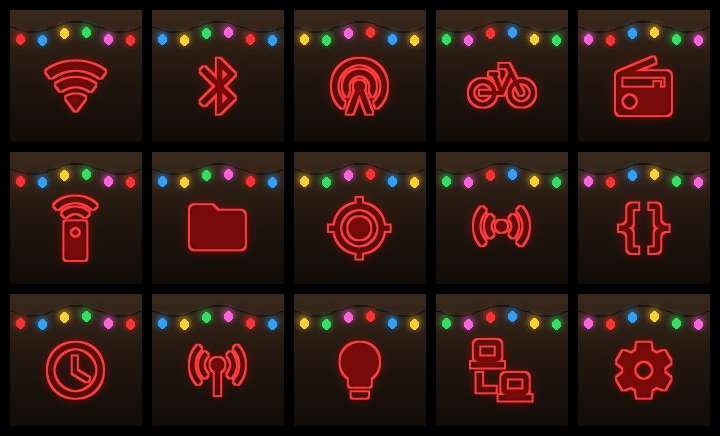 |   <br><sub>`e8e3` `8ac7` `841`</sub> |  |
| **`wasteland-terminal`**<br><sub>[boot](previews/pop/wasteland-terminal-boot.gif)</sub> | 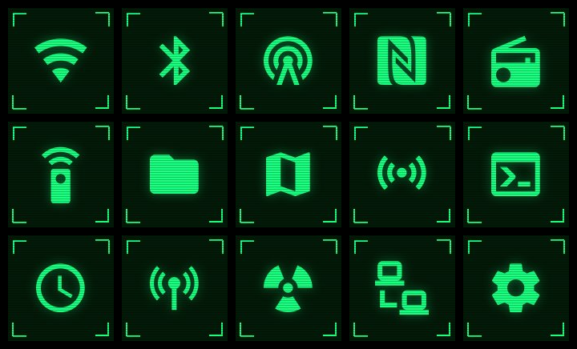 |   <br><sub>`1ff0` `c48` `c1`</sub> |  |
| **`wild-encounter`**<br><sub>[boot](previews/pop/wild-encounter-boot.gif)</sub> | 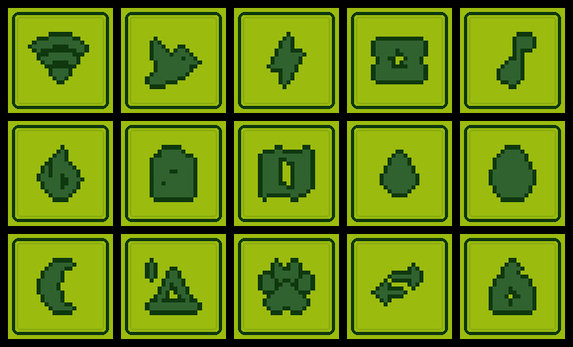 |   <br><sub>`9c1` `3306` `9de1`</sub> |  |
<!-- pop:end -->

> All pop art is drawn by the generator from generic icon glyphs and shapes. There's no official artwork, sprites or logos, and no affiliation with any rights holder.

<details>
<summary><b>Build the pop themes</b></summary>

```bash
./bruce-pop-gen.py                   # all pop themes -> pop/<name>/
./bruce-pop-gen.py p-cat --littlefs  # one theme + local/p-cat-littlefs.bin
```

`code-rain` draws its katakana with Noto Sans CJK (`noto-fonts-cjk`), which the repo doesn't bundle.
</details>

---

## ▌Install

Pick **one** of the three ways below.

### A — microSD card (easiest, lets you keep many themes)

1. Format a microSD card as **FAT32**. Any size works; the themes are ~85 KB each.
2. Copy theme folders to the **root** of the card, e.g. `themes/japglitch/` → `SD:/japglitch/`, `monster/vampire/` → `SD:/vampire/` or `pop/p-cat/` → `SD:/p-cat/`. You can copy all of them at once.
3. On the device: **Config → UI Theme → SD → `japglitch/japglitch.json`**.

> [!NOTE]
> The first time Bruce boots with a card that has no `bruce.conf` on it, it writes a **default** config to the card, which resets your theme. Just pick the theme again once; from then on the setting is saved to both the card and internal storage.

### B — Flash a ready-made LittleFS image (no SD card needed)

Each [release](../../releases) has a `<theme>-littlefs.bin` containing the theme plus a tiny `bruce.conf` that selects it, so **the theme is active on the very next boot** without touching the screen.

```bash
# CYD 2432S028: Bruce's LittleFS ("spiffs") partition lives at 0x3d0000, size 0x30000
esptool --port /dev/ttyUSB0 --baud 460800 write-flash 0x3d0000 japglitch-littlefs.bin
```

> [!WARNING]
> This **replaces everything in Bruce's internal storage**: settings, saved Wi-Fi, IR/RF captures.
> Other boards use a different offset and size. Read the `spiffs` entry from the Bruce `.bin` for your board, then rebuild with `--fs-size`:
> ```bash
> python -c "import struct,sys;d=open(sys.argv[1],'rb').read()[0x8000:0x8c00]
> for i in range(0,len(d),32):
>  e=d[i:i+32]
>  if e[:2]!=b'\xaa\x50':break
>  o,s=struct.unpack('<II',e[4:12]);print(e[12:28].rstrip(b'\0').decode(),hex(o),hex(s))" Bruce-YOURBOARD.bin
> ```

### C — Build your own (see below) and use A or B.

---

## ▌Generate a theme from any Omarchy palette

```bash
pip install -r requirements.txt
./bruce-theme-gen.py neon-unix-legs                      # -> themes/neon-unix-legs/
./bruce-theme-gen.py japglitch --fringe C921E4,2090E3    # pin the RGB-split colors
./bruce-theme-gen.py hypr-heels --littlefs               # + flashable hypr-heels-littlefs.bin
./bruce-theme-gen.py tux-mosaic --sd --boot-wallpaper        # PNG icons + wallpaper boot anim (SD only)
./bruce-theme-gen.py --colors ~/my/colors.toml --name mine
```

It reads `~/.config/omarchy/themes/<name>/colors.toml` (or any file with `background`, `foreground`, `accent` and `color0`–`color15` as `"#RRGGBB"`), then:

| Step | What happens |
|---|---|
| 🎨 **Palette** | `foreground` → text/icons, `background` → bg, `color8` → unselected items. All converted to Bruce's **RGB565**. |
| 🌈 **Fringe** | Picks the two most vivid, most hue-separated palette colors that *aren't* close to the icon color. Override with `--fringe`. |
| 🔣 **Icons** | Material Design glyphs from **JetBrainsMono Nerd Font**, centred, RGB-split, with sliced scanline displacement and accent glitch bars. Same seed per icon, so rebuilds come out identical. |
| 🎞️ **Boot** | 8-frame GIF: the `BRUCE` title glitches in and settles (MrRobot font if installed). |
| 🧾 **JSON** | Writes `<name>.json` with every menu key, border on, and the LED set to the first fringe color. |
| 💾 **LittleFS** | Optional `--littlefs`: builds a flash image (4 KB blocks, `name_max=64`) with a preset `bruce.conf`. |

After adding a theme, `./tools-gallery.py` rebuilds the gallery GIF and the theme table in this README.

<details>
<summary><b>All options</b></summary>

| Flag | Default | |
|---|---|---|
| `--screen WxH` | `320x240` | Device resolution |
| `--icon-size PX` | 55% of height | Icon size (75% with `--no-label`) |
| `--no-label` | off | Hide menu names under icons, use bigger icons |
| `--sd` | off | PNG icons instead of JPG (sharper, see size notes) |
| `--boot-wallpaper [FILE]` | off | Put the theme's wallpaper behind the boot title |
| `--fringe HEX,HEX` | auto | RGB-split colors |
| `--littlefs [OUT]` | off | Also build a LittleFS image |
| `--fs-size N` | `0x30000` | LittleFS partition size |
| `--out DIR` | `themes` | Output root |

Other boards, per the Bruce wiki: Cardputer / StickC Plus `--screen 240x135`, T-Embed `--screen 320x170`, T-LoRa Pager `--screen 480x222`.
</details>

---

## ▌Things I learned the hard way

- **PNG icons blow up LittleFS.** Bruce 1.16 decodes each PNG once and caches it as raw RGB565 in `<theme>/tmp/<icon>.bin`. At 130 px that's ~34 KB *per icon*, about 500 KB for a full set, and the CYD only has **192 KB** of LittleFS. It fills up, Bruce shows `LittleFS is Full` (it needs ≥ 4 KB free) and floods serial with `lfs.c: No more free space`. **JPG and BMP are drawn directly, with no cache**, so the default output is JPG. Use `--sd` (PNG) only for themes that live on a microSD card.
- **Colors are RGB565 hex, not `#RRGGBB`.** White is `ffff`, not `ffffff`. LED colors *are* normal hex.
- **`themeOnSd` means the filesystem, not a yes/no:** `1` = LittleFS, `2` = SD.
- **Scanline textures ruin JPG compression.** Icons without them are ~3–5 KB each.
- **The wallpaper boot GIF is ~130 KB,** fine on SD but too big for internal storage alongside the icons. The plain-background version is ~21 KB.

---

## ▌theme.json reference

```jsonc
{
  "wifi": "wifi.jpg", "ble": "ble.jpg", "rf": "rf.jpg", "rfid": "rfid.jpg",
  "fm": "fm.jpg", "ir": "ir.jpg", "files": "files.jpg", "gps": "gps.jpg",
  "nrf": "nrf.jpg", "interpreter": "interpreter.jpg", "clock": "clock.jpg",
  "lora": "lora.jpg", "others": "others.jpg", "connect": "connect.jpg", "config": "config.jpg",
  "priColor": "f7d6",   // RGB565: text + selected
  "secColor": "a52c",   // RGB565: unselected items
  "bgColor":  "20e5",   // RGB565: background
  "border": 1,          // frame around the menu
  "label": 1,           // show menu name under icon (use ~50 px smaller icons)
  "boot_img": "boot.gif",
  "ledBright": 60, "ledColor": "C921E4", "ledEffect": 0, "ledEffectSpeed": 3, "ledEffectDirection": 1
}
```

Paths are relative to the JSON file. Supported images: BMP, JPG, PNG, GIF.

---

<div align="center">

Themes and generator: MIT. Bruce is © its authors ([BruceDevices/firmware](https://github.com/BruceDevices/firmware)).
Palettes come from Omarchy themes. Icons are rendered from [Nerd Fonts](https://www.nerdfonts.com) Material Design glyphs.
Bundled fonts are all SIL Open Font License, see [`fonts/`](fonts/): [Creepster](https://fonts.google.com/specimen/Creepster) (monster), [Press Start 2P](https://fonts.google.com/specimen/Press+Start+2P), [Fredoka](https://fonts.google.com/specimen/Fredoka), [Bangers](https://fonts.google.com/specimen/Bangers), [Cinzel Decorative](https://fonts.google.com/specimen/Cinzel+Decorative), [Pacifico](https://fonts.google.com/specimen/Pacifico), [VT323](https://fonts.google.com/specimen/VT323), [Antonio](https://fonts.google.com/specimen/Antonio), [Oswald](https://fonts.google.com/specimen/Oswald), [Orbitron](https://fonts.google.com/specimen/Orbitron) and [Libre Baskerville](https://fonts.google.com/specimen/Libre+Baskerville) (pop). `hacker-mask` uses the MrRobot font if it's installed, and falls back to Orbitron.

<sub>▚▞▚▞ made on Omarchy, tested on a real Cheap Yellow Display ▞▚▞▚</sub>

</div>
